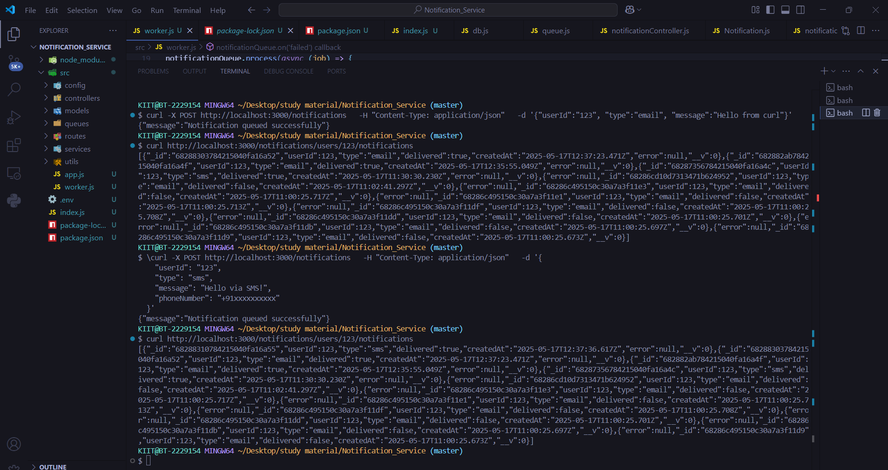

# Notification Service

A simple Notification Service built with Node.js, Express, MongoDB, Redis + Bull queue for asynchronous notification processing.  
Supports sending notifications via Email, SMS (using Twilio), and in-app notifications with retry logic for failed jobs.

---

## Features

- **API Endpoints**  
  - `POST /notifications` — Send a notification (email, SMS, in-app)  
  - `GET /users/:id/notifications` — Fetch notifications for a specific user

- **Notification Types**  
  - Email (queued and saved)  
  - SMS via Twilio (queued, sent, delivery tracked, error logged)  
  - In-app notifications saved for users

- **Asynchronous Processing**  
  - Uses Bull queue backed by Redis to handle notification jobs  
  - Automatic retries for failed notifications with exponential backoff

- **Persistence**  
  - MongoDB stores notification data, delivery status, and error logs

---

## Project Structure

- ├── src
- │ ├── config
- │ │ └── queue.js # Bull queue setup
- │ ├── models
- │ │ └── Notification.js # Mongoose schema for notifications
- │ ├── routes
- │ │ └── notifications.js # API route handlers
- │ ├── utils
- │ │ └── sendSMS.js # Twilio SMS sending utility
- │ ├── worker.js # Queue worker processing notifications
- │ └── index.js # Express server entry point
- ├── .env # Environment variables
- ├── package.json
- └── README.md


---

## Setup & Installation

### Prerequisites

- Node.js (v16+ recommended)  
- MongoDB (local or remote instance)  
- Redis server (local or remote)  
- Twilio account credentials (for SMS notifications)  

---

### Environment Variables

Create a `.env` file in the project root with:
- PORT=3000
- MONGODB_URI=mongodb://localhost:27017/notifications
- REDIS_URL=redis://127.0.0.1:6379
- SMTP_USER=your_email@example.com
- SMTP_PASS=your_email_password
- TWILIO_SID=your_twilio_account_sid
- TWILIO_AUTH=your_twilio_auth_token
- TWILIO_PHONE=+1234567890


### Install dependencies
npm install

### Running the Server and Worker

- Start your MongoDB and Redis servers.
- Start the Express API server:node src/index.js
- In a separate terminal, start the queue worker to process notification jobs:node src/worker.js

## API Usage

 ### Send Notification:POST /notifications
- Request body JSON:
  ```bash
  {
  "userId": "123",  
  "type": "sms",          // "email", "sms", or "in-app"
  "message": "Hello!",
  "phoneNumber": "+911234567890"  // required for SMS only
  }

-  Example cURL command:
    ```bash
    curl -X POST http://localhost:3000/notifications \ H "Content-Type: application/json" \ d '{"userId":"123","type":"sms","message":"Hello via SMS!","phoneNumber":"+911234567890"}'
 
  ### Get User Notifications
- Example:
   ```bash
  curl http://localhost:3000/users/123/notifications
- Response:
  ```bash
  [  
  {  
    "_id": "123abc",  
    "userId": "123",  
    "type": "sms",  
    "message": "Hello via SMS!",  
    "delivered": true,  
    "error": null,  
    "createdAt": "2025-05-17T11:30:30.230Z"  
  },  
  ]  

## 🧠 Why Bull + Redis instead of RabbitMQ or Kafka?

For this Notification Service, **Bull** (a Node.js job queue) paired with **Redis** was chosen over more complex message brokers like **RabbitMQ** or **Kafka** for several practical reasons:

### ✅ Simplicity and Integration
- **Bull** is purpose-built for Node.js and integrates seamlessly.
- It requires minimal setup and configuration compared to RabbitMQ or Kafka.
- Redis is lightweight and easy to run locally or in the cloud, making development faster.

### ✅ Built-in Features for Notifications
- Bull provides **built-in support for retries**, **delayed jobs**, **job prioritization**, and **failure handling**, all essential for notification delivery.
- These features reduce boilerplate code and make it easier to maintain the system.

### ✅ Use Case Fit
- This service is a lightweight **background job processing** system, not a high-throughput data stream.
- Kafka is ideal for **massive real-time data pipelines**, and RabbitMQ for **enterprise-level message orchestration** — both are overkill for this scope.

### ✅ Faster Development and Deployment
- Bull + Redis can be set up quickly and deployed with fewer moving parts.
- Ideal for **prototyping**, **intern projects**, or **microservices** that need background processing without complex dependencies.


## 📸 Screenshot




